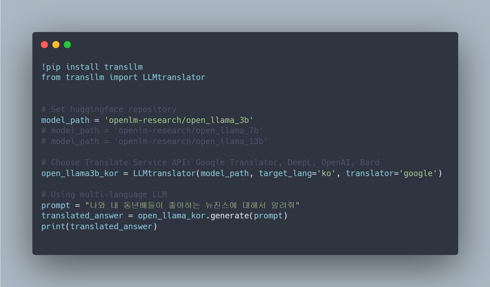
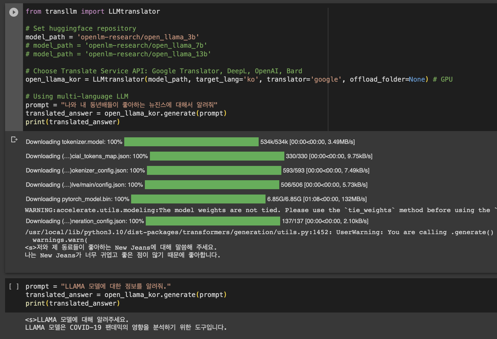

Development Status :: 3 - Alpha

# Python Package: hf-transllm

<p align="left">
<a></a>
<a href="https://github.com/psf/black"></a>
<a href="https://hits.seeyoufarm.com"></a>
<a href="https://pypi.org/project/transllm/"></a>
</p>


> LLMtranslator translates and generates text in multiple languages using LLMs(Large Language Models) on hugging-face repository.



### Introducing hf-transllm: Unlock the Power of Multilingual Exploration

Discover the hf-transllm package, a seamless integration of Hugging Face's inference module and translation APIs. Overcome limitations in retraining and evaluating large language models in different languages. Explore diverse results effortlessly, leveraging translation API services. Emphasizing versatility over efficiency, hf-transllm enables you to delve into the outcomes of Hugging Face's models in various languages.


<br>


<br>

## Installation
```
pip install transllm
```
Or
```
pip install git+https://github.com/dsdanielpark/hf-trnasllm.git
```

<br>

## CLI
If you wish to use CLI:
```
git clone https://github.com/dsdanielpark/hf-transllm
cd hf-transllm
pip install -r requirements.txt
```
```bash
python main.py --hfmodel <openlm-research/open_llama_3b> --lang <ko> --translator <google>
```
There can be issues with various dependencies such as Hugging Face's Transformers, SentencePiece, Torch, and CUDA. Please set up the appropriate environment by searching online.
<br>

<br>

## Usage    

> Simple Usage
```python
from transllm import LLMtranslator

open_llama3b_kor = LLMtranslator('openlm-research/open_llama_3b', target_lang='ko', translator='google') # Korean

trnaslated_answer = open_llama3b_kor.generate("나와 내 동년배들이 좋아하는 뉴진스에 대해서 알려줘")
print(trnaslated_answer)
```
<br>

> Google Trnaslator
- Support Languages: https://github.com/nidhaloff/deep-translator/blob/master/deep_translator/constants.py
```python
from transllm import LLMtranslator

# Set huggingface repository
model_path = 'openlm-research/open_llama_3b'
# model_path = 'openlm-research/open_llama_7b'
# model_path = 'openlm-research/open_llama_13b'

# Get TransLLM Object (Korean)
open_llama3b_kor = LLMtranslator(model_path, target_lang='ko', translator='google') # Unofficial test
# open_llama3b_kor = LLMtranslator(model_path, target_lang='ko', translator='google_official', google_api_key='xxxxxx') # Official Google Cloud Translation API 


# Using Prompt in multi-language
prompt = "나와 내 동년배들이 좋아하는 뉴진스에 대해서 알려줘"
trnaslated_answer = open_llama3b_kor.generate(prompt)
print(trnaslated_answer)
```

DeepL
- Support Languages: https://www.deepl.com/pro/select-country?cta=header-pro-button/#developer

Open AI, Bard use pre-prompt for translation.
```python
from transllm import LLMtranslator

# Set huggingface repository
model_path = 'openlm-research/open_llama_3b'
# model_path = 'openlm-research/open_llama_7b'
# model_path = 'openlm-research/open_llama_13b'

# Choose Translate Service API: DeepL, OpenAI, Bard
open_llama3b_kor = LLMtranslator(model_path, target_lang='ES', translator='deepl', deepl_api='xxxxxxx') # Language == Spanish
# open_llama3b_kor = LLMtranslator(model_path, target_lang='korean', translator='openai', openai_api='xxxxxxx', openai_model='gpt-3.5-turbo')
# open_llama3b_kor = LLMtranslator(model_path, target_lang='korean', translator='bard', bard_api='xxxxxxx')

# Using Prompt in multi-language
prompt = "나와 내 동년배들이 좋아하는 뉴진스에 대해서 알려줘"
trnaslated_answer = open_llama3b_kor.generate(prompt)
print(trnaslated_answer)
```

<br>


Google Colab Example <br><br>
[](https://colab.research.google.com/drive/1117ikGEmU4FncBDl1xCC2IhPPDOr75lX?usp=sharing) 



## Customized Inference
Applying LLMs to the majority of Hugging Face repositories is generally feasible. However, it can be challenging to apply them to objects that require unique tokenizers or inference processes. In such cases, it is recommended to customize the usage by incorporating a translation module for prompts.

In other words, if you are familiar with the inference process or code from Hugging Face repositories, you can customize the translation object by adding a translation module before and after the known inference process or code. Check [translang repository](https://github.com/dsdanielpark/translang) for more details.
```python
import torch
from trnasllm import LLMtranslator


class MyLLMtranslator(LLMtranslator):
    def __init__(
        self,
        model_path,
        target_lang="ko",
        translator="google",
        torch_dtype=torch.float16,
        device_map="auto",
        deepl_api=None,
        bard_api=None,
        openai_model="gpt-3.5-turbo",
        openai_api=None
    ):
        super().__init__(
            model_path=model_path,
            target_lang=target_lang,
            translator=translator,
            torch_dtype=torch_dtype,
            device_map=device_map,
            deepl_api=deepl_api,
            bard_api=bard_api,
            openai_model=openai_model,
            openai_api=openai_api
        )

    def inference(self, prompt: str) -> str:
        # Custom logic for inference
        # You can override the implementation of the inference method here
        # and provide your own logic for generating the translated answer
        # Remember to return the translated answer as a string.

        answer = customizing_process(prompt)
        # Custom inference logic...
        
        return answer
```

<br>

## About Google Translator
Commercial use or official use of the Google Translate service is chargeable. Please provide the `translator="google_official"` and `google_api_key={YOUR_API_KEY}` arguments. Please responsibly use the `translator="google"` argument for the purpose of simple functionality verification. Refer to the following [notebook file](https://github.com/dsdanielpark/translang/blob/main/scripts/google_official.ipynb) and [official link](https://cloud.google.com/translate?utm_source=google&utm_medium=cpc&utm_campaign=japac-KR-all-en-dr-BKWS-all-mv-trial-EXA-dr-1605216&utm_content=text-ad-none-none-DEV_c-CRE_631260646738-ADGP_Hybrid%20%7C%20BKWS%20-%20EXA%20%7C%20Txt%20~%20AI%20&%20ML_Translation%20AI_google%20translate%20api_main-KWID_43700073965169292-kwd-14329410560&userloc_1009871-network_g&utm_term=KW_google%20translate%20api&gclid=Cj0KCQjwy9-kBhCHARIsAHpBjHjTvBCM7NNcf4fYGsog4ViQErgJvACFXB5JCNUT0h_EpQ5kyUT-SrIaApZBEALw_wcB&gclsrc=aw.ds&hl=ko) for more information. Use the google argument only for some basic functionality testing.


## [FAQs](./documents/FAQs.md)
Use `Ctrl`+`F` for help in this `FAQs.md`.

## Contributors

I would like to express my sincere gratitude for the contributions made by all the contributors.

<a href="https://github.com/dsdanielpark/hf-transllm/graphs/contributors">
  
</a>


<br>

## License
[MIT](https://opensource.org/license/mit/) <br>
I hold no legal responsibility; 
```
The MIT License (MIT)

Copyright (c) 2023 Minwoo Park

Permission is hereby granted, free of charge, to any person obtaining a copy
of this software and associated documentation files (the "Software"), to deal
in the Software without restriction, including without limitation the rights
to use, copy, modify, merge, publish, distribute, sublicense, and/or sell
copies of the Software, and to permit persons to whom the Software is
furnished to do so, subject to the following conditions:

The above copyright notice and this permission notice shall be included in all
copies or substantial portions of the Software.

THE SOFTWARE IS PROVIDED "AS IS", WITHOUT WARRANTY OF ANY KIND, EXPRESS OR
IMPLIED, INCLUDING BUT NOT LIMITED TO THE WARRANTIES OF MERCHANTABILITY,
FITNESS FOR A PARTICULAR PURPOSE AND NONINFRINGEMENT. IN NO EVENT SHALL THE
AUTHORS OR COPYRIGHT HOLDERS BE LIABLE FOR ANY CLAIM, DAMAGES OR OTHER
LIABILITY, WHETHER IN AN ACTION OF CONTRACT, TORT OR OTHERWISE, ARISING FROM,
OUT OF OR IN CONNECTION WITH THE SOFTWARE OR THE USE OR OTHER DEALINGS IN THE
SOFTWARE.
```

## Bugs and Issues
Sincerely grateful for any reports on new features or bugs. Your valuable feedback on the code is highly appreciated.

## Contacts
- Core maintainer: [Daniel Park, South Korea](https://github.com/DSDanielPark) <br>
- E-mail: parkminwoo1991@gmail.com <br>

## Reference 
[1] https://huggingface.co/docs/api-inference/index <br>
  
<br>
            

  
*Copyright (c) 2023 MinWoo Park, South Korea*<br>
